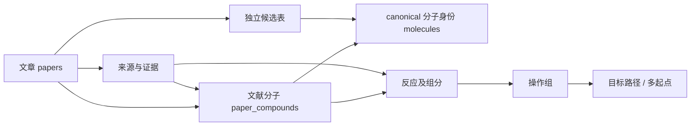

# 全库提取与统一数据库

以 `data/papers.json` 的 133 篇文章为范围。`data/atlas.sqlite` 是新的统一数据库；
`data/database/report.html` 可直接在浏览器中打开，支持按标题、DOI、paper ID 和状态筛选。
实际覆盖数字以 `data/extraction/batch_summary.json` 和数据库的 `v_paper_coverage` 为准。
**全库逐步结构提取尚未完成**，页定位和部分名称候选不等于每一步路线都已提取。

## 数据层次

| 层次 | 表 / 视图 | 含义 |
|---|---|---|
| 文献目录 | `papers`, `targets`, `paper_status` | 文章、目标名称、当前提取状态；历史“已获取”与本地可用性分开 |
| 文献证据 | `source_artifacts`, `evidence_locations` | 文件或压缩包成员哈希、页码/未分页定位、文本线索；不冒充反应记录 |
| 统一分子身份 | `molecules` | 按 canonical isomeric SMILES 去重；来源和可信度在关联表中 |
| 旧版目标候选 | `target_structure_candidates` | 保留原候选及来源状态；不能当作原文准确结构 |
| 名称解析候选 | `provisional_compounds`, `provisional_reaction_endpoints` | 精确标题名称解析及部分编号反应端点；单独保存未解析编号与方法局限 |
| 原生绘图候选 | `embedded_structure_candidates`, `embedded_structure_evidence` | 从 Word 内 OLE/CDX 读取的结构；保留对象来源，不猜编号或反应角色 |
| 原生反应端点 | `native_reaction_steps`, `native_reaction_fragments`, `native_reaction_components` | CDX ReactionStep 显式关联的反应物/产物；缺失或无效端点仍保留，不能冒充全文完整路线 |
| 原生图式序列 | `native_scheme_routes`, `native_scheme_route_steps` | 已核对连接关系的有限图式；例如 Coerulescine SI Scheme 2 的 10→11→12→13→14→15→1 |
| 案例转录分子 | `paper_compounds`, `compound_evidence` | 文献编号、结构依据、立体信息状态、来源页、人工推定标识 |
| 反应及操作 | `reaction_events`, `reaction_components`, `operation_steps`, `operation_components` | 一个反应事件可有多个操作组或多个产物；试剂/溶剂另存 |
| 参与物 | `participants`, `operation_participants` | 试剂和溶剂原文名称及能明确表示的结构；不能明确建模时保留名称 |
| 路线 | `routes`, `route_start_compounds`, `route_steps`, `route_molecules` | 多起点、汇聚关系、目标路径和排序；保留全合成/形式全合成边界 |
| 质量与复现 | `issues`, `extraction_runs`, `database_metadata` | 缺口、冲突、每篇导入结果、软件版本与输入哈希 |

完整列定义在 [`data_dictionary.json`](../data/database/data_dictionary.json)，
DDL 在 [`atlas-database.schema.sql`](../data/atlas-database.schema.sql)。
这是受反应数据库设计启发的 Atlas schema，**不是已通过 Open Reaction Database protobuf 验证的提交文件**。



## canonical SMILES 规则

显式使用 `Chem.MolToSmiles(mol, canonical=True, isomericSmiles=True)`，并记录 RDKit
版本。canonicalization 是同一分子图的确定性序列化，**不会修复原始分子图的错误**。
不同 RDKit 版本的规范字符串可能变化，所以复现需要固定版本。

- 保留已说明的四面体构型、双键几何、同位素、电荷、盐和断开的组分。
- 不自动补充未知立体化学，不进行互变异构体归一化、去盐或中和。
- 数据库分子身份移除 atom-map 编号，原输入及 `original_atom_mapping_json` 另外保存。
- 相同结构可共用一个 `molecule_id`；不同文章中的“化合物 6”始终是不同的文献记录。
- 外消旋、未拆分混合物、构型未说明等信息保存在 `stereo_status` / `metadata_json`，
  不能仅凭一个无 `@` 的 SMILES 推断这些状态。
- 反应 SMILES 也规范化各侧的分子图。`reactants>>products` 表示已记录的底物/产物，
  并不表示全部试剂、计量、机制或 atom mapping 已经确定。

此前 Aspidosperma 案例的旧目标候选与原文结构存在连通性差异；因此没有用旧候选
自动填补所有文章的反应中间体。差异保存在该案例的 `legacy_candidate_comparison.json`。

## 提取状态

| 状态 | 可以得出的结论 |
|---|---|
| `extracted_candidate_pending_review` | 通过数据库校验的文献内案例网络已导入；仍有明确范围和待复核问题 |
| `partial_provisional_candidates` | 有来源绑定的部分名称/编号候选，不能当作完整反应网络 |
| `partial_native_reaction_endpoints` | 已保存原生图式的反应端点与 canonical SMILES；全文路线归属和覆盖尚未核对完 |
| `pending_structure_transcription` | 来源已索引，仍需从原图确定原子、键、立体标记并建立完整反应拓扑 |
| `source_missing_local` | 当前归档没有正文/SI；历史 acquisition 标记不代表当前文件可用 |
| `source_unreadable_or_unsupported` | 文件存在但格式/文本读取尚未解决 |
| `metadata_only` | 该批处理仅纳入文献目录，不汇编高毒毒素的可复现逐步合成细节 |
| `*_validation_failed` | 数据没有通过导入校验；该篇相应事务回滚，具体原因在 `issues` |

`source_bound_dataset_imported=1` 与 `complete_route_verified=1` 是不同主张；本批次没有
独立专家审定。所有 `formal_benchmark_eligible` 均为 false。反应事件数、操作组数、
目标路径数也不同：不要把同一反应出现在多条路径中计为多个实验。

原文和 SI 有时内容相同但字节哈希不同。批处理另计算规范化页面文本哈希，标记
`duplicate_of`，避免把正文副本当作独立 SI 证据。不同来源别名可指向同一内容；
SQLite 的 `source_id` 保留导入时的别名以维持引用稳定。

## 批处理与复现

在仓库根目录运行：

```powershell
.venv/Scripts/python.exe scripts/batch_extract_atlas.py --rebuild-cases
```

该命令检查全部文章和归档文件、按文件哈希复用私有文本缓存、重新编译已实现的案例
adapter、重建 SQLite，并导出 CSV 和离线报告。**它不会把尚未实现的识图步骤伪装成成功。**
`--inventory-only` 只刷新来源清单。归档默认为仓库父目录，可用 `--archive-root` 指定。

确定性名称提取是另一阶段：

```powershell
.venv/Scripts/python.exe scripts/deterministic_batch_candidates.py --inventory data/extraction/batch_inventory.json
.venv/Scripts/python.exe scripts/batch_extract_atlas.py
```

名称提取所需 OPSIN/Java 与缓存信息见该脚本和候选 JSON 中的 `software` / 方法记录。
本次使用可在 PATH 调用的 Java 22，以及 [官方 OPSIN 2.9.0 CLI](https://github.com/dan2097/opsin/releases/tag/2.9.0)。
将发布页的 `opsin-cli-2.9.0-jar-with-dependencies.jar` 放入 `.local/tools/`；脚本会校验
SHA256 `c2e29326c281f87b59a05d934d8589adac6e9d17b95b984931b3e739111b360f`。
也可用 `scripts/batch_extract_atlas.py --rebuild-cases --extract-names` 顺序执行这些阶段。
名称可以解析不代表原文绘图正确匹配；无法解析的名称和未关联的编号保留为缺口。
严格的来源标题规则可能漏掉跨页名称、仅有图像的编号结构或自然产物俗名。

原生 ChemDraw 提取需要额外依赖：

```powershell
.venv/Scripts/python.exe -m pip install -r requirements-embedded.txt
.venv/Scripts/python.exe scripts/batch_extract_atlas.py --rebuild-cases --extract-names --extract-native --extract-native-reactions
```

该阶段读取 Word 中的 OLE/CDX 数据，用 RDKit 2026.03.6 自带的 ChemDraw CDX
扩展直接转换分子图并生成 canonical isomeric SMILES。运行环境必须满足
`Chem.HasChemDrawCDXSupport()`。无法解释的别名、查询原子及转换异常保留为拒绝记录。
这些对象可能是原料、中间体、试剂或背景示意图；没有足够证据时编号和角色保持 null。
原生候选的分子式验证是图数据内部一致性检查，不是原文 HRMS 验证。
全局去重分子数与保留来源每次出现的候选记录数不同。

`--extract-native-reactions` 从 CDX ReactionStep 的 Reactants/Products 对象引用读取
连接关系，按确切片段对象提取分子。当前 6 篇中有 132 个原生步骤，117 步的全部引用片段
已解析；这些图式可能属于底物范围、优化、背景文献或正文路线，不能统称为全合成步骤。
可在 [`native_reactions.html`](../data/database/native_reactions.html) 查看重新绘制的分子图，
在 `native_reactions.csv`、`native_reaction_components.csv` 和 `native_reaction_evidence.csv`
查询逐步 SMILES、对象编号与文件哈希。

Coerulescine 的 SI Scheme 2 已连通 7 个分子和 6 步反应，保存在
`data/extraction/native_reactions/paper-17346d5cc784e311.json` 的 `scoped_routes` 中。
这篇只有 Word SI，缺正文与化合物 10 的上游制备，故 `full_article_route_coverage=false`。
二进制 Word 文本通过 FIB/CLX 片段表读取，证据使用 OLE 流/对象定位，不伪造页码。

转换器 revision 4 沿用原生 RDKit 并拒绝带文本的未指定原子节点及不支持的非四面体立体标记。
例如 Bpin 或图号不得自动变成甲烷；这也使当前可解析端点计数比 revision 3 更保守。
原生 RDKit 替换了旧 Open Babel 路径。交叉检查发现后者对部分大对象编号的
CDX 结构曾输出截断分子，甚至只剩 `C`；因此 canonical 语法检查不是充分验证。
新路径同时检查原生片段 ID、原图明确绘制的重原子数下限、查询原子、分子式和
SMILES 往返。所有原生候选已重新生成，不保留截断结构作为当前正确端点。
不进行价态修补；Coerulescine 的 NMe 缩写由原生 CDX 展开直接读取。
若原生结构含 AND/OR 立体组，另存 `enhanced_stereo_cxsmiles`，避免普通 SMILES 丢失
该类语义；文献是否为外消旋或相对构型仍需结合正文判断。

Ineleganolide 的 SI 已单独整理为第三个来源核对案例：27 个结构、21 个制备事件、
4 条路径，见 `data/routes/paper-77cc3e5bcb3be4ba/report.html`。
14 项 HRMS 中性分子式核对通过；化合物 29 的加合离子标注冲突及溶剂冲突原样记录。
原生 ReactionStep 会把试剂或方括号中间体列为产物，故案例按原图和实验段落校正角色，
未将原生关系直接晋升为专业数据集真值。化合物 30 是图示机理中间体，不另造分离步骤。
正文缺失，SI 引用的上游制备与作者报告的实验分别标记；完整文章覆盖仍为 false。
Word 来源使用文件哈希、嵌入对象路径、CDX 哈希及段落定位，不编造页码。

当前累计 9 篇来源绑定案例、192 个文献内分子记录、139 个制备事件、151 个操作组和
34 条路径（包含对照分支），全部待独立专家复核。
前两篇新增案例分别为 16/21 个分子、
11/14 个制备事件，详见 [案例边界与复现](EPIMEDONINS_AND_SPERMIDINES_CASES.md)。
Epimedonins 覆盖正文与 SI 绘出的正向网络；Spermidines 仅覆盖现有 SI，缺正文。
盐型冲突保存为文献分子的元数据，不将共价母体 SMILES 当作已核实的分离盐结构；
定性产率及未报告数字产率通过事件元数据保留，不伪造百分数。

[模块化 Glabridin](MODULAR_GLABRIDIN_EXTRACTION_CASE.md) 覆盖 SI 第 2 节的 26 个制备事件，
区分两种目标对映体和部分消旋的产物 18。35 个分子记录包含 13a/13a′ 等不同非对映体；
同一次混合物投料实验不拆成两次独立成功反应。来源绘出的无编号碘代中间体计入操作序列，
共 27 个操作组。前 3 张 Word 图仅有 EMF，没有原生 CDX；通过 `document_figure`
定位保存 `word/media/` 成员、成员字节 SHA256、XML 段落与整体 DOCX 哈希。
导入器严格检查该定位类型及 DOCX 格式，案例编译器校验实际源文件哈希。

原部分提取的 19 篇采用[固定批次进度](PARTIAL19_PROGRESS.md)跟踪。新增 Keramamine C
（13 个分子、8 个事件，其中目标路线 5 步）、Coerulescine（7 个分子、6 个事件的 SI 片段）
与 Rhodocoranes C/D/E（18 个分子、12 个事件、13 个操作记录）。只有后者已覆盖本文绘出的
成功目标路线；前两者缺正文，Coerulescine 还缺中间体 10 的上游制备。
二进制 Word 使用 `binary_word_cdx_object`：源文件哈希、`ObjectPool/_编号/CONTENTS`、
CDX 哈希及原生对象 ID，不虚构 DOCX 的段落或 PDF 页码。

公开来源补查可运行 `scripts/acquire_missing_sources.py`。当前缺源条目的访问结果在
`data/extraction/source_acquisition.json`，并随 inventory 写入数据库审计记录；摘要、
登录页和 JavaScript 检查页不会被算作正文。

正文文本、页面截图、下载源和工具二进制均位于忽略的 `.local/`；不会复制进公开数据。
ZIP 内的 PDF 用成员字节哈希命名存入私有目录，引用同时保留容器哈希与成员路径。
DOCX 的文本定位没有伪造 PDF 页码。

构建输入库存另存为 `data/extraction/database_input_inventory.json`；最终的
`batch_inventory.json` 包含数据库校验后的状态。输入哈希采用前者的规范 JSON 序列化，
避免状态回写使构建输入不可追溯。交付验证还检查目录、候选、案例、schema 和政策
的哈希，输入变更而未重建数据库时会明确失败。

数据库在临时文件中构建，通过 SQLite 外键和完整性检查后替换输出。单篇无效路线
不影响其他文章导入。来源 inventory 已检查归档清单中的文件 SHA256；数据库导入器
校验引用绑定，但本身不再次打开所有出版商文件，`source_bytes_verified` 不能解读为
导入器已独立完成原文视觉审核。

## 查询与导出

```python
import sqlite3
con = sqlite3.connect('data/atlas.sqlite')
con.row_factory = sqlite3.Row

# 全部文章状态及已整理的实际记录数。
rows = con.execute('SELECT * FROM v_paper_coverage ORDER BY paper_id').fetchall()

# 某篇各目标路径中按操作依赖排序的 reaction SMILES。
steps = con.execute('''
    SELECT * FROM v_route_step_sequence WHERE paper_id = ?
    ORDER BY route_id, step_index
''', ('paper-0ae671ac9a8bbe22',)).fetchall()

# 分子序列与逐条原文来源。
structures = con.execute('''
    SELECT * FROM v_compound_provenance WHERE paper_id = ?
    ORDER BY local_label, source_id, page_number
''', ('paper-0bac8bc7088bc164',)).fetchall()
```

`v_route_smiles_sequence` 是分子拓扑顺序；对于汇聚路线，邻接记录不一定直接反应。
真正的底物/产物连接在 `reaction_components` 和 `operation_components` 中。
`route_start_compounds` 给出所有起点，不能只读取兼容用的单一 `start_label`。

CSV 位于 `data/database/`。`compounds.csv` / `route_steps.csv` 是案例转录数据；
`provisional_*.csv` 与 `legacy_target_candidates.csv` 是独立候选，不应无条件混入训练集。
数据划分优先按 DOI/文章家族分组，避免同一公共中间体或同一论文的分支泄漏。

验证：

```powershell
.venv/Scripts/python.exe scripts/validate_atlas_database.py
.venv/Scripts/python.exe -m pytest tests/test_route_extraction.py tests/test_glabridin_case.py tests/test_atlas_database.py tests/test_batch_extraction.py tests/test_database_delivery.py -q
```

旧快照的顶层 `CHECKSUMS.sha256` 在本次任务前就与归档内容不一致；没有重写旧发布记录
来隐藏差异。新数据库导出有独立 `data/database/datapackage.json` 文件哈希清单，各案例
也有自己的校验清单。

原部分提取的 19 篇均已有绑定原文来源的数据集：11 篇覆盖本文所绘成功路线，
6 篇仅覆盖现有 SI 范围，另 2 篇仍是存在断点的路线片段。
Coniferin 新增 23 个分子、12 个反应事件、6 条片段；Ternatusine 新增 8 个分子、4 个反应事件、3 条片段。
未知供体和有矛盾的后段转化存入各案例 `dataset.json` 的 `unresolved_events`，不生成补造的 reaction SMILES。
本文路线覆盖不包含引用文献的全部上游制备，也不等于独立化学专家确认。
逐篇分子、反应、操作、路线计数及缺口见 [固定批次进度](PARTIAL19_PROGRESS.md)。
